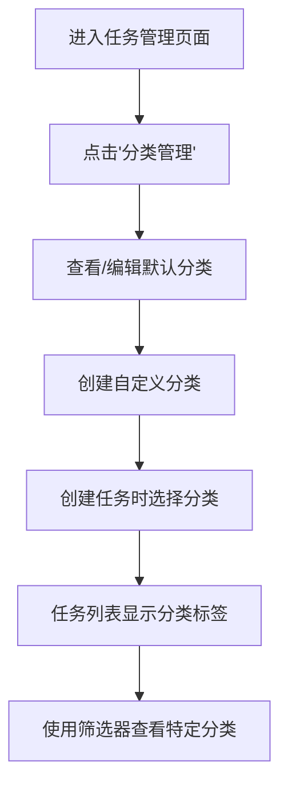

# 任务属性标签功能文档

## 概述

任务属性标签功能为生活管理系统的任务管理模块添加了单属性分类标签系统。用户可以为每个任务设置一个分类属性（如：工作、学习、自我提升等），实现任务的精确分类和时间统计。

## 设计理念

### 单属性 vs 多属性

**采用单属性模式的核心原因：**

1. **时间统计准确性**
   ```
   ❌ 多标签问题：
   任务A: 2小时，标签[学习, 自我提升]
   - 学习: 2小时？
   - 自我提升: 2小时？
   - 总计: 4小时？（明显错误）

   ✅ 单属性解决：
   任务A: 2小时，分类[学习]
   - 学习: 2小时 ✓
   - 统计清晰准确 ✓
   ```

2. **强制思考本质**
   - 避免决策逃避，明确任务主要目的
   - 帮助用户认清时间真正花费在哪里

3. **简单即是美**
   - 用户决策成本低
   - 界面清晰直观
   - 数据分析无歧义

## 技术架构

### 数据库设计

#### 1. 分类表 (task_categories.db)
```sql
CREATE TABLE task_categories (
  id INTEGER PRIMARY KEY AUTOINCREMENT,
  name TEXT NOT NULL UNIQUE,           -- 分类名称
  color TEXT NOT NULL,                 -- 显示颜色 (HEX)
  icon TEXT,                          -- 图标（预留）
  display_order INTEGER DEFAULT 0,    -- 显示排序
  created_at DATETIME DEFAULT CURRENT_TIMESTAMP,
  updated_at DATETIME DEFAULT CURRENT_TIMESTAMP
)
```

#### 2. 任务表更新 (tasks.db)
```sql
-- 新增字段
ALTER TABLE tasks ADD COLUMN category_id INTEGER;

-- 外键关系（逻辑关联，不强制约束）
-- REFERENCES task_categories(id)
```

### API 设计

#### 分类管理 API
```typescript
// 获取所有分类
GET /api/task-categories
Response: TaskCategory[]

// 创建分类
POST /api/task-categories
Body: { name: string, color: string, icon?: string, order?: number }
Response: TaskCategory

// 更新分类
PUT /api/task-categories
Body: { id: number, name?: string, color?: string, icon?: string, order?: number }
Response: TaskCategory

// 删除分类
DELETE /api/task-categories?id=<id>
Response: { success: boolean }
```

#### 任务 API 更新
```typescript
// 现有任务 API 已支持 categoryId 字段
POST /api/tasks
Body: { ..., categoryId?: number }

PUT /api/tasks
Body: { ..., categoryId?: number }
```

### 数据类型

```typescript
interface TaskCategory {
  id?: number
  name: string
  color: string          // HEX 颜色码
  icon?: string          // 图标标识（预留）
  order?: number         // 显示排序
  createdAt?: string
  updatedAt?: string
}

interface Task {
  // ... 现有字段
  categoryId?: number    // 新增分类ID
}
```

## 功能特性

### 1. 预设分类

系统初始化时自动创建 7 个常用分类：

| 分类名称 | 颜色代码 | 排序 | 说明 |
|---------|----------|------|------|
| 工作 | #3B82F6 | 1 | 职业相关任务 |
| 学习 | #10B981 | 2 | 知识技能学习 |
| 自我提升 | #8B5CF6 | 3 | 个人成长发展 |
| 健康 | #EF4444 | 4 | 运动健康相关 |
| 生活 | #F59E0B | 5 | 日常生活事务 |
| 娱乐 | #EC4899 | 6 | 休闲娱乐活动 |
| 通勤 | #6B7280 | 7 | 交通出行时间 |

### 2. 分类管理界面

#### 入口
- 位置：任务管理页面右上角
- 按钮：「分类管理」

#### 功能
- ✅ 查看所有分类
- ✅ 创建新分类（名称 + 颜色选择）
- ✅ 编辑现有分类
- ✅ 删除分类（检查关联任务）
- ✅ 实时预览颜色效果

#### 界面设计
```
┌─────────────────────────────┐
│  任务分类管理               │
├─────────────────────────────┤
│  🔵 工作          [编辑][删除]│
│  🟢 学习          [编辑][删除]│
│  🟣 自我提升      [编辑][删除]│
│  ...                      │
├─────────────────────────────┤
│  [+ 添加新分类]             │
└─────────────────────────────┘
```

### 3. 任务创建/编辑

#### 创建任务
```
任务标题: [________________]
任务描述: [________________]
                [________________]

重要度: [2 (重要) ▼]  分类: [学习 ▼]

[保存] [取消]
```

#### 编辑任务
- 支持修改分类
- 保持与创建界面一致的交互体验
- 实时保存，无需额外确认

### 4. 视觉标识系统

#### 任务列表显示
```
✅ 完成算法作业  [2] [学习]
   为了提升编程能力...

☐ 跑步30分钟    [1] [健康]
   保持身体健康...
```

#### 标签样式
- **形状**：圆角矩形
- **颜色**：使用分类自定义颜色
- **文字**：白色，确保对比度
- **尺寸**：小型标签，不干扰主要内容
- **交互**：鼠标悬停显示「分类: {name}」

### 5. 分类筛选功能

#### 筛选器位置
- 任务管理页面右上角
- 与分类管理按钮并排显示

#### 筛选逻辑
```typescript
// 伪代码
const filteredTasks = selectedCategoryFilter
  ? tasks.filter(task => task.categoryId === selectedCategoryFilter)
  : tasks
```

#### 用户体验
- **实时筛选**：选择后立即过滤显示
- **全选选项**：「所有分类」显示全部任务
- **状态保持**：当前会话内保持筛选状态

## 使用指南

### 1. 基础使用流程



### 2. 分类设置建议

#### 个人时间管理
```
📚 学习      - 技能提升、知识获取
💼 工作      - 职业任务、项目工作
🏃 健康      - 运动、医疗、养生
🏠 生活      - 家务、购物、社交
🎯 目标      - 个人项目、长期规划
```

#### 学生用户
```
📖 学术      - 课程学习、作业研究
🎓 考试      - 备考、复习、测验
🔬 项目      - 课程项目、实验
🤝 社交      - 社团活动、聚会
💼 实习      - 工作经历、职场准备
```

#### 工作人员
```
💻 核心工作  - 主要业务、项目交付
📊 管理      - 会议、报告、协调
📚 学习      - 技能提升、行业研究
🏠 生活      - 个人事务、家庭时间
🎯 规划      - 职业发展、目标设定
```

### 3. 最佳实践

#### ✅ 推荐做法
- **明确主要目的**：为任务选择最主要的分类
- **定期回顾**：根据使用情况调整分类设置
- **保持简洁**：分类数量控制在 5-8 个
- **颜色区分**：使用明显不同的颜色便于识别

#### ❌ 避免做法
- 创建过多相似分类
- 为同一任务纠结多个属性
- 频繁更改分类系统
- 忽视时间统计的准确性

## 数据迁移

### 现有任务处理
- 所有现有任务的 `categoryId` 字段默认为 `null`
- 显示为「无分类」状态
- 用户可以逐步为现有任务设置分类

### 向后兼容
- 不影响现有功能的正常使用
- 分类功能为增强功能，非强制要求
- 数据库变更采用 ADD COLUMN 方式，完全向后兼容

## 未来扩展

### 短期优化
1. **时间统计图表**：按分类显示时间分配饼状图
2. **分类模板**：提供不同用户类型的分类模板
3. **导入导出**：支持分类配置的导入导出

### 长期规划
1. **智能分类建议**：基于任务内容自动推荐分类
2. **分类规则**：设置关键词自动归类规则
3. **时间目标**：为每个分类设置时间分配目标
4. **分析报告**：生成详细的时间分配分析报告

## 技术细节

### 性能考虑
- 分类数据量小，全量加载到内存
- 筛选操作在前端进行，响应速度快
- 数据库查询添加适当索引

### 错误处理
- 分类删除前检查关联任务
- 重名分类创建自动提示
- 网络请求失败的友好提示

### 安全性
- 输入验证和 SQL 注入防护
- 分类名称长度和字符限制
- 颜色值格式验证

## 测试场景

### 功能测试
1. ✅ 创建、编辑、删除分类
2. ✅ 为任务设置和修改分类
3. ✅ 分类筛选和显示
4. ✅ 数据持久化和同步

### 边界测试
1. ✅ 删除有关联任务的分类（应该失败）
2. ✅ 创建重名分类（应该提示）
3. ✅ 无效颜色值处理
4. ✅ 网络断开时的操作

### 用户体验测试
1. ✅ 界面响应速度
2. ✅ 操作流畅性
3. ✅ 错误信息清晰度
4. ✅ 视觉设计一致性

---

## 结语

任务属性标签功能通过单属性设计理念，为用户提供了简单而强大的任务分类管理能力。它不仅解决了时间统计的准确性问题，还帮助用户更好地理解和管理自己的时间分配。

这个功能完美集成到现有的任务管理系统中，提供了直观的用户界面和完整的管理功能。通过合理的分类设置和持续使用，用户可以获得对个人时间使用情况的深入洞察。